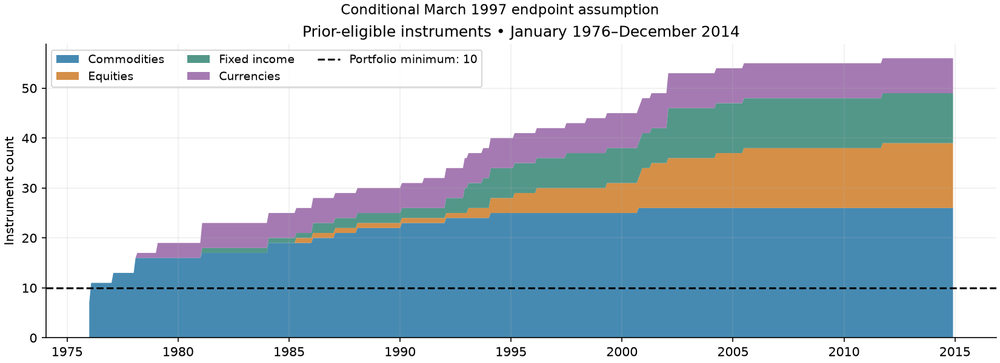
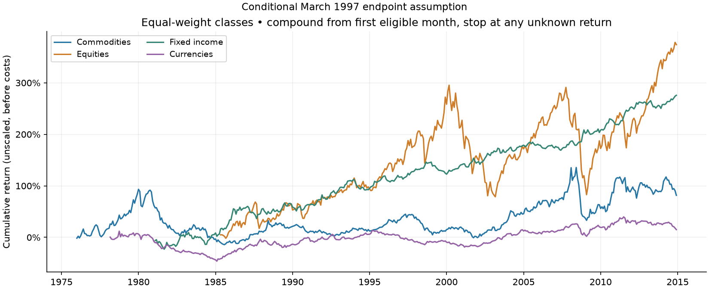
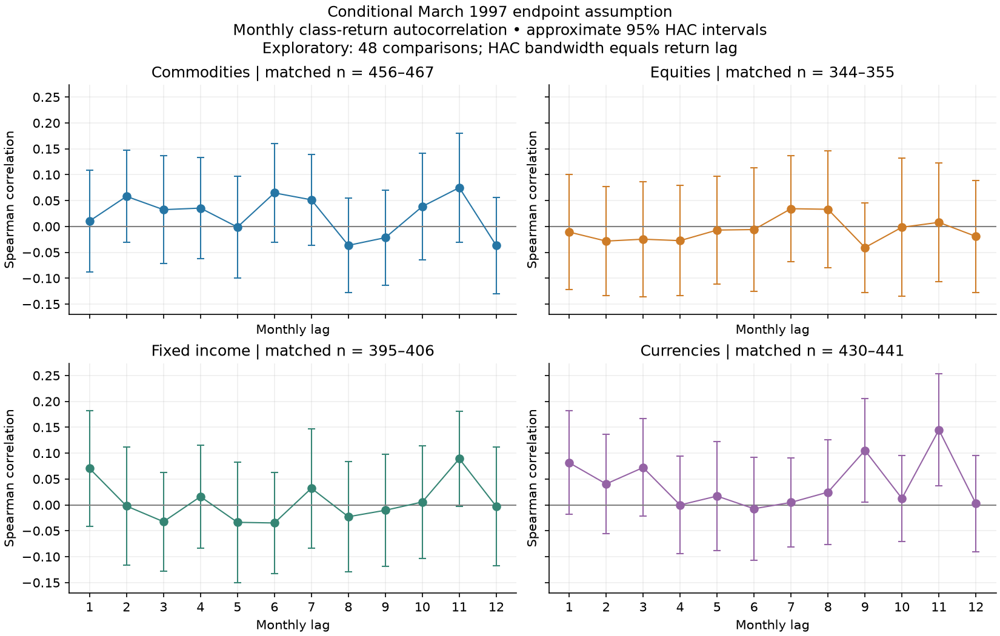
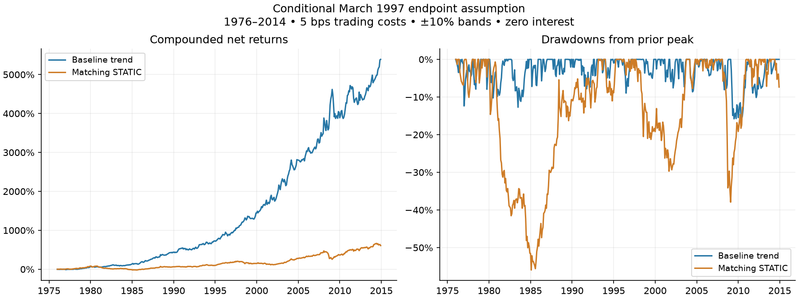
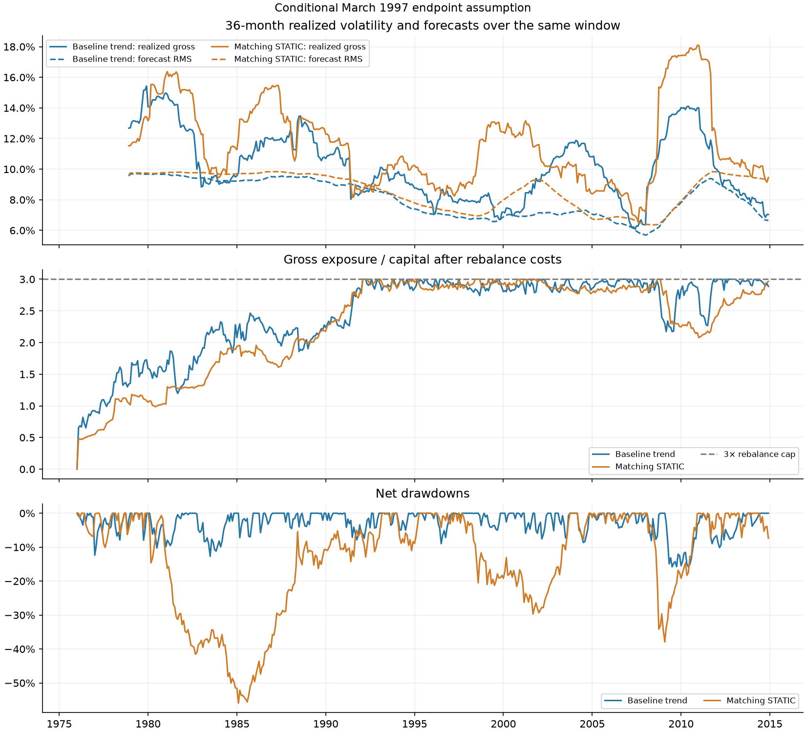

# Managed futures: 15-minute midterm report

**All results are conditional on an unverified endpoint assumption:** March 27, 1997 is used as the March endpoint for DT, GS, LX and SS, restoring eight March/April returns. [Exact changes](output/endpoint_sensitivity/endpoint_changes.csv) · [Evidence note](../../docs/ENDPOINT_DECISION.md) · [Preserved-policy status](../../docs/DATA_STATUS.md).

| Section | Time | Show | Point to make |
| :--- | ---: | :--- | :--- |
| Question and answer | 1 min | Opening takeaway | Does trend direction add value under the same controls? |
| Data | 1.5 min | Coverage chart | 1976–2014; January is flat; results use one explicit endpoint assumption |
| Asset classes | 2 min | Statistics and cumulative chart | Equal-weight prior-eligible class portfolios; unequal histories matter |
| Autocorrelation | 1.5 min | Rank-correlation chart | Persistence evidence is limited and exploratory |
| Construction | 2 min | Four-step strategy description | Direction, risk sizing, limits, then bands; explain STATIC |
| Results | 3 min | Main comparison and drawdowns | Full-period improvement; recent performance is more modest; costs matter |
| Risk | 2.5 min | Rolling risk and class attribution | Forecasts underpredict fluctuations; commodities dominate average forecast risk |
| Limits and improvements | 1.5 min | Three priorities | Verify data/execution, improve risk calibration, then test unexamined history |

## 1. Question and answer — 1 min

**Question:** does following 12-month trends add value over an always-long portfolio under the same controls?

**Answer:** trend improves full-period risk-adjusted performance versus matching STATIC in this conditional historical study. Recent performance is more modest. The result supports further research; data provenance, execution and risk calibration still need work.

## 2. Data — 1.5 min

| Item | Definition |
|---|---|
| Evaluation | January 1976–December 2014; 468 monthly observations |
| Inputs | Monthly returns, daily futures prices and an instrument/class map |
| Universe | 58 retained columns; YM duplicate and EC unresolved identity excluded |
| Timing | Prior 12-month signal and 36-month risk windows; earlier data initialize the model |
| Source selection | RL/ER is one exposure; switch to ER in 2006-01 using history known through t−2 |

January 1976 has 7 eligible instruments, below the minimum of 10; that month is flat. Trading starts in 1976-02. Missing held returns fail explicitly. The original eight calendar-supported return corrections are retained.

**Point to make:** the requested dates are retained, including the flat January month. All displayed results use the explicit endpoint assumption stated above.

## 3. Asset classes — 2 min

Each class return equally weights instruments eligible before the month. Statistics are calculated from the class portfolio series. Empty classes remain missing; an unavailable eligible constituent makes the whole class return missing.

| Class | Instruments | Eligible instrument-months | Portfolio months | First month |
| --- | ---: | ---: | ---: | ---: |
| Commodities | 26 | 10,533 | 468 | 1976-01 |
| Equities | 13 | 2,462 | 356 | 1985-05 |
| Fixed income | 10 | 2,489 | 407 | 1981-02 |
| Currencies | 7 | 2,604 | 442 | 1978-03 |

| Class | Monthly mean | Monthly SD | Annual mean | Annual vol | Sharpe |
| --- | ---: | ---: | ---: | ---: | ---: |
| Commodities | 0.19% | 3.62% | 2.32% | 12.54% | 0.19 |
| Equities | 0.55% | 4.59% | 6.54% | 15.89% | 0.41 |
| Fixed income | 0.35% | 2.32% | 4.23% | 8.03% | 0.53 |
| Currencies | 0.06% | 2.43% | 0.73% | 8.40% | 0.09 |

Annual mean = 12 × monthly mean; annual volatility = √12 × sample monthly SD; Sharpe assumes **RF = 0**. Coverage differs across classes, so these available-history estimates are not a fully matched four-class comparison. Compounding starts at each class's first eligible month and stops at an unknown subsequent return.

**Takeaway:** fixed income has the highest descriptive Sharpe, followed by equities; currencies are weakest. Differing history and eligibility prevent a direct replication of the lecture's class statistics.

## 4. Autocorrelation — 1.5 min

Spearman rank correlation compares each **class portfolio's monthly return** with its calendar-shifted return at lags 1–12. Missing pairs are removed after shifting. This differs from averaging instrument autocorrelations.

| Class | Matched pairs across lags | Approximate p < 0.05 |
| --- | ---: | ---: |
| Commodities | 456–467 | 0/12 |
| Equities | 344–355 | 0/12 |
| Fixed income | 395–406 | 0/12 |
| Currencies | 430–441 | 2/12 |

Approximate 95% intervals use standardized-rank regressions with calendar-spaced Bartlett HAC scores, bandwidth equal to return lag, n/(n−2) correction and t(n−2) critical values. All 48 comparisons are exploratory and unadjusted for multiple testing.

**Takeaway:** the class diagnostics provide limited persistence evidence. They do not establish the profitability or optimality of the 12-month signal. [All estimates and intervals](output/endpoint_sensitivity/autocorrelation.csv).

## 5. Construction — 2 min

1. **Direction:** sign of the sum of the previous 12 monthly returns; zero means flat.
2. **Risk:** previous 36 months; 2% annual instrument-volatility floor; correlations shrunk 50% toward zero.
3. **Size:** initial magnitude 0.40 / (eligible count × annual instrument volatility); reduce proportionally to a **10% forecast-risk ceiling** and **3× gross cap** after rebalance costs.
4. **Trade:** use a ±10% relative band; entries, exits and reversals execute immediately. Hard limits override bands.

STATIC is always long with identical eligibility, risk estimates, limits, bands and costs; its own forecast determines scaling. The comparison measures the value of trend direction under matching controls.

**Difference from Lecture 6:** the lecture baseline uses expanding volatility with zero cross-instrument covariance; its later extension targets 11% forecast volatility. Our model uses a fixed 36-month window, shrinkage, a 10% ceiling, gross cap and bands. It scales down but does not scale up to a risk target. This is an enhanced baseline, not a matched lecture replication.

## 6. Results — 3 min

Net returns; **5 bps per unit of traded exposure**, ±10% bands, RF = 0. Annual mean is arithmetic; CAGR compounds monthly returns.

| Metric | Trend | STATIC |
| --- | ---: | ---: |
| Annual mean | 10.84% | 5.74% |
| CAGR | 10.82% | 5.15% |
| Annual volatility | 10.26% | 11.85% |
| Net Sharpe | 1.06 | 0.48 |
| Maximum drawdown | -15.82% | -55.95% |
| Annual turnover / capital | 6.36 | 0.72 |
| Annual direct cost drag | 0.318% | 0.036% |

Trend/STATIC correlation is **0.15**. Annualized alpha is **10.11%**, with 95% HAC interval **[7.19%, 13.03%]**. Alpha is 12 × the monthly regression intercept against STATIC, using 6 HAC lags; its interval excludes strategy-selection and data-provenance uncertainty.

**Takeaway:** trend has higher full-period CAGR and Sharpe, with a much smaller drawdown. The evidence is conditional and in sample.

| Period | Trend mean | STATIC mean | Trend Sharpe | STATIC Sharpe |
| --- | ---: | ---: | ---: | ---: |
| 1976–1984 | 9.89% | -0.49% | 0.85 | -0.04 |
| 1985–1994 | 13.52% | 8.78% | 1.27 | 0.76 |
| 1995–2004 | 13.01% | 7.03% | 1.42 | 0.66 |
| 2005–2014 | 6.82% | 7.01% | 0.72 | 0.57 |

These are descriptive blocks of the existing trading path, not new holdouts. Recent mean returns are weaker; the full-period advantage is not uniform. [Block and crisis diagnostics](output/endpoint_sensitivity/stability.csv).

### Implementation costs

| Portfolio | Cost (bps) | CAGR | Sharpe |
| --- | ---: | ---: | ---: |
| TREND | 0 | 11.16% | 1.09 |
| STATIC | 0 | 5.19% | 0.49 |
| TREND | 5 | 10.82% | 1.06 |
| STATIC | 5 | 5.15% | 0.48 |
| TREND | 10 | 10.47% | 1.03 |
| STATIC | 10 | 5.11% | 0.48 |

Costs cover initial entry, actual drift-adjusted trades, RL/ER close/open trades and final liquidation. They are illustrative; historical spread, impact and roll costs are unavailable.

The ±10% band reduces trend turnover by **13.5%** and direct annual cost drag by **4.97 bps** versus no band. Net annual mean changes by **-5.51 bps**. The band saves trading but does not improve every performance measure. [All cost and no-band comparisons](output/endpoint_sensitivity/comparison.csv).

## 7. Risk — 2.5 min

| Portfolio | Average gross exposure | RMS forecast vol | Calibration SD |
| --- | ---: | ---: | ---: |
| TREND | 2.45× | 8.16% | 1.26 |
| STATIC | 2.28× | 8.75% | 1.41 |

Calibration SD measures gross return variability after dividing each return by its preceding forecast monthly volatility; one is ideal. The values above show underprediction. A 10% forecast ceiling is not a realized-volatility or loss guarantee.

The risk plot compares trailing 36-month realized gross volatility with RMS forecasts for **the same 36 months**. Exposure limits apply at rebalances; exposure can drift between them.

Trend class attribution:

| Class | Annual net contribution | Contribution vol | Average gross exposure | Average forecast-vol contribution |
| --- | ---: | ---: | ---: | ---: |
| Commodities | 5.90% | 7.85% | 0.90× | 4.74% |
| Equities | 1.59% | 3.30% | 0.20× | 1.15% |
| Fixed income | 1.55% | 3.07% | 0.83× | 0.94% |
| Currencies | 1.79% | 3.39% | 0.52× | 1.17% |

Monthly net class contributions include actual instrument costs and sum to net portfolio return. Annual means and signed Euler forecast-risk contributions add; **class volatilities do not**. Classes have unequal risk allocations, with commodities contributing most of the average forecast risk. [Full attribution](output/endpoint_sensitivity/trend_class_attribution.csv).

## 8. Limits and improvements — 1.5 min

**Suitable for a midterm:** a clear economic idea, a fair STATIC comparison, transparent costs, and reproducible accounting. **Evidence for future performance is limited:** the sample has been studied repeatedly, the endpoint assumption remains unverified, and execution/roll/FX conventions are idealized. No fresh out-of-sample test or superiority over the lecture is established.

Three priorities:

1. **Verify data and execution:** resolve venue/vendor endpoints and validate next-session fills, roll/FX conventions and contract accounting.
2. **Improve risk calibration:** test a more responsive estimator; evaluate true volatility targeting and deliberate class-risk budgets as future extensions.
3. **Test unexamined history:** freeze the rules, evaluate them on new data, then monitor forward paper trading.

These improvements are proposed future work.

**Validation:** 86 tests pass; the preserved 2000–2014 refactor replay matches all 12 archived runs. [Code guide](../../docs/CODE_GUIDE.md) · [Methods](../../docs/RISK_METHODS.md) · [Validation](../../docs/VALIDATION.md) · [15-minute presentation guide](../../docs/MIDTERM_GUIDE.md).

Reproduce: `python scripts/run_research.py --endpoint-sensitivity`. The standalone HTML embeds all five figures.
